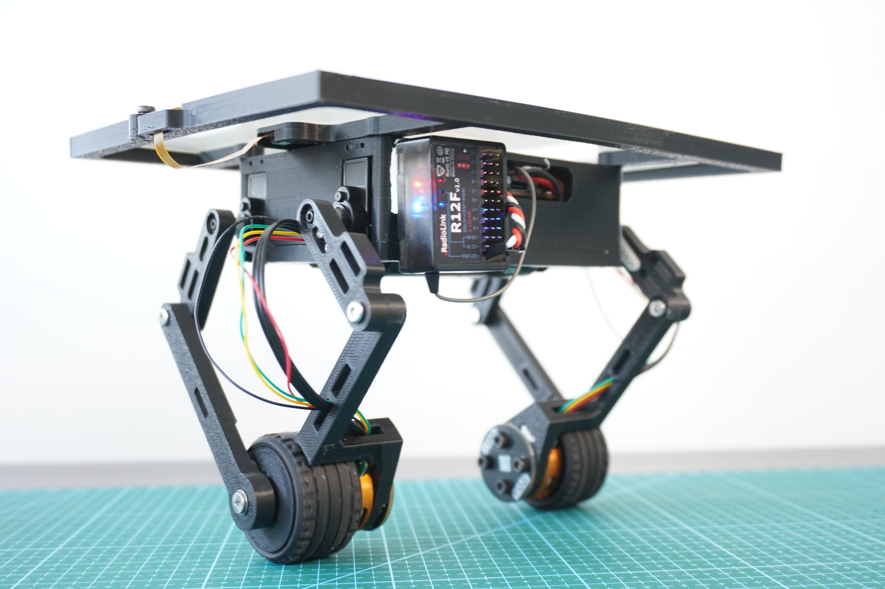
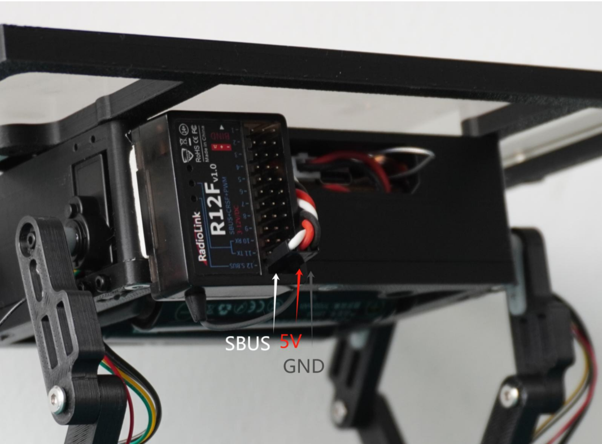
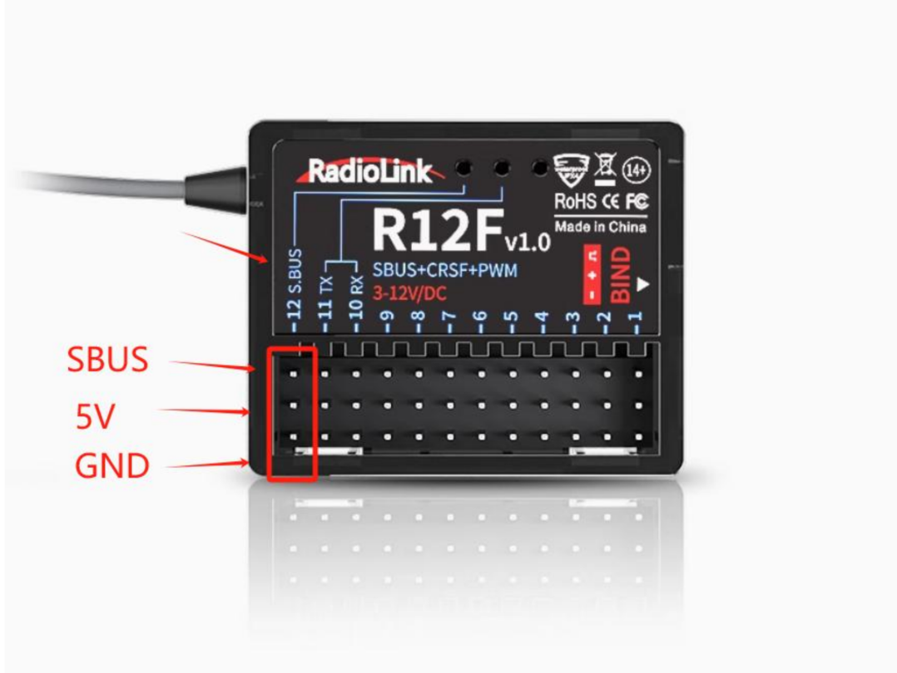

# Navbot-ES02 - Open Source Desktop Dual-Wheel Legged Robot



**Navbot-ES02** is a compact, open-source desktop robot that combines self-balancing wheels with articulated legs. It’s an experimental platform for exploring locomotion, balance, and user interaction — ideal for makers, educators, and robotics enthusiasts.

Full tutorial: [Frank Fu’s Build Guide](https://frankfu.blog/embodied-ai-robot/diy-desktop-dual-wheel-legged-roboy/)

---

##  Key Features

-  **Self-balancing** using MPU6050 and PID control
-  **Legged motion** using 270° digital servos
-  **Touchscreen interface** for motion control to achieve  ball-balancing
-  **Radiolink T12D RC System** for real-time operation switching via PWM/SBUS.
-  **Modular Arduino-based firmware** for easy customization

---

## Hardware Overview

| Component      | Description                                   |
|----------------|-----------------------------------------------|
| **MCU**        | ESP32-S3 DevKit                               |
| **Motors**     |  2208 90KV 3mm Shaft Gimbal Brushless Motors            |
| **IMU**        |  ICM42688 a 3-axis gyroscope and a 3-axis accelerometer            |
| **Servos**     | Pro-Tronik PTK 7452 MG-D 2.8kg/0.11s 12.3g Micro Digital Servo     |
| **HMI**        | 2.8" resistive/capacitive touchscreen         |
| **Battery**    | 2Pcs 18650 Battery Charger Pack              |
| **Controller**    | Radiolink T12D 12CH 2.4G RC Transmitter R12F Receiver                     |

---


## 📦 Software Structure

```
Navbot-ES02/
├── OllieFOCdrive/     # Motor & balance control
├── TouchUI/           # Touchscreen-based user interface
├── WiFiControl/       # Optional WebSocket/HTML control panel
├── partitions.csv     # Flash partition layout
└── lib/               # Required Arduino libraries
```

---

The current firmware supports the two-wheel balancing robot only. Legacy four-wheel gait control and master/slave communication have been removed. UART1 remains available for the touchscreen, and UART2 handles SBUS.

## Project documentation

The canonical hardware and software documentation follows the two target trees:

- [Robot and ESP32 hardware](docs/robot/hardware/system-overview.md), [robot software/control](docs/robot/software/control/control-flow.md), and the [BLE communication protocol](docs/robot/software/interfaces/NavBot-ES02-BLE-communication-protocol-V1.2.pdf).
- [ros2_pc hardware and attached peripherals](docs/ros2_pc/hardware/README.md) and [ros2_pc software/roadmap](docs/ros2_pc/software/README.md). ros2_pc details remain pending until hardware is selected and verified.

## Getting Started

### 1. Install Requirements

- Arduino CLI with the ESP32 board package installed
- Libraries (via Library Manager or GitHub):
  - [SimpleFOC](https://github.com/simplefoc/Arduino-FOC)
  - [SimpleFOcDrivers](https://github.com/simplefoc/Arduino-FOC-drivers)
  - ArduinoJson
  - Queue (`cppQueue.h`)

The repository does not pin the ESP32 core or Arduino library versions. The build uses the versions installed in your Arduino CLI environment.
    
### 2. Build and flash the firmware

```bash
git clone https://github.com/fuwei007/Navbot-ES02.git
cd Navbot-ES02
python3 scripts/build_firmware.py
```

The command builds the NavBot sketch into `build/flash`. Run `python3 scripts/build_firmware.py --help` to choose another sketch, board, output directory, or build properties. To flash a compiled build, use the configured `navbot_flash` MCP tool `flash_firmware` with the absolute build directory from the active worktree. Check the serial MCP `list_ports` before reporting that the board is disconnected, close the serial MCP connection before flashing, and keep balance disabled with motor outputs safe. See the [canonical USB/serial documentation](docs/robot/software/development/usb-serial-flashing.md) for board settings and verified connection details.

### Safe sensor diagnostics

The full, current procedure is in the [sensor diagnostic guide](docs/robot/software/diagnostics/sensor-diagnostic-mode.md), including safe motor outputs, build and flash steps, SerialPlot settings, the 17-column channel map, and reset troubleshooting. The source currently sets `SENSOR_DIAGNOSTIC_MODE=0`, which builds normal motor-control firmware. Set it to `1` and rebuild for sensor diagnostics. Diagnostic mode skips motor and servo initialization and holds the wheel-driver enable pins low. Support the robot mechanically because the legs are not driven. The diagnostic stream currently uses 576000 baud through the CH340 UART at the user's direction. The hardware UART rate at 576000 has not yet been measured, and this setting is not hardware-accepted.

### Capture a balance shutdown

With `SENSOR_DIAGNOSTIC_MODE` set to `0`, upload the rebuilt sketch and support the robot so it cannot fall. Close every other serial monitor, then run:

```bash
python3 scripts/capture_balance_trace.py --seconds 20 --output balance-trace.log
```

The script waits for startup, sends `K55`, and records a nominal 142.9 Hz `TRACE` stream, one row for every seventh executed control gate (nominally 1 kHz). Switch RC channel 5 from off to on **once** during the capture. The columns are `time_ms,ch5_mode,ch6_mode,voltage_min_raw_v,voltage_filtered_v,roll_deg,pitch_deg,servo1_cmd_deg,servo2_cmd_deg,servo3_cmd_deg,servo4_cmd_deg,servo1_range_deg,servo2_range_deg,servo3_range_deg,servo4_range_deg,motor1_target,motor2_target,sequence,logger_dropped,uart_write_failures`. Each `range` is the highest minus lowest integer servo command since the preceding row, nominally 7 ms. The minimum voltage uses all battery ADC samples since the previous row; it is still a board ADC estimate, not a measurement of the ESP32's 3.3 V rail. The servo values are commanded angles, not measured shaft positions. The saved log also includes any reboot or brownout text that reaches the serial port. The script sends `K0` at the end to stop tracing. If the robot loses power, retain the log even if the script reports a port error.

After uploading firmware built from the current source, add `--trace-mode 56` and choose a new output file to capture the compact `CTRL` stream instead. It records `time_ms,ch5_mode,voltage_min_raw_v,voltage_filtered_v,roll_deg,gyro_z_rad_s,body_turn_command,angle_error_deg,angle_output,yaw_error,yaw_output,motor1_target,motor2_target,max_servo_range_deg,sequence,logger_dropped,uart_write_failures`. The angle and yaw outputs are the two terms combined into the wheel targets; an inactive balance mode reports zero for their error/output columns. Selected trace modes suppress repeated low-voltage and BLE debug text to keep it out of CSV rows. `body_turn_command` and `yaw_error` use the firmware's numerical scale; do not assume they are physical rad/s without checking the RC mapping. Existing firmware images that only implement `K55` must be reflashed for this mode.

For controller decomposition, `--trace-mode 57` records `BAL` rows: `time_ms,ch5_mode,voltage_min_raw_v,roll_deg,angle_error_deg,angle_out_p,angle_out_i,angle_out_d,body_x,motor1_target,motor2_target,max_servo_range_deg,sequence,logger_dropped,uart_write_failures`. Its shorter lines use the same asynchronous sender and 576000 baud stream. Give each run a unique output filename.

For forward/reverse motion and stopping behavior, `--trace-mode 58` records `DRIVE` rows: `time_ms,ch5_mode,voltage_min_raw_v,voltage_filtered_v,ch3_target,effective_speed_target,motor1_velocity_f,motor2_velocity_f,tick_dt_s,speed_error,speed_out_p,speed_out_i,speed_out_d,speed_output,speed_body_x_raw,body_x,body_pitching_f,roll_ok,angle_output,angle_out_p,angle_out_i,angle_out_d,wheel_speed_feedback,motor1_target,motor2_target,top_ball_x,touch_x,body_pitching,max_servo_range_deg,sequence,logger_dropped,uart_write_failures`. Use this only after confirming the trace output with CH5 off; each run should have a new filename. The logger samples nominally at 142.9 Hz without changing controller gains or the control-gate cadence. Nyquist is about 71.4 Hz; signals above that can alias, and the configured 50 Hz IMU low-pass cutoff is based on nominal 1 kHz sampling rather than a measured runtime cadence. No active-balance hardware measurement has established control-cycle timing or UART integrity under transmission load.

The current `DIAGNOSTIC_LIVE_TUNING_DEFAULTS=1` build starts with angle P/I/D=5/200/0.11 and integral limit 0.1, speed P/I/D=0.045/0.005/0 and integral limit 50, yaw P/I/D=4/0/0, and direct wheel-speed feedback `V=0`. Live tuning starts enabled (`U1`), and these gains also apply when the physical CH5 switch passes briefly through mode 1. Keep CH9 and CH10 centered during driving. The startup speed integral is `SI0.005`, matching the live settings the user reported as free of vibration on 2026-10-01. This observation tested the complete gain set, not the speed integral in isolation. The direct wheel-speed feedback contributes only when the driver requests less speed in the current direction or commands a reversal, including after CH3 returns to neutral, and is limited to ±8 motor-target units. `V0` disables it. `V` reads the current value. The speed-loop BodyX term is limited to ±10 mm and its unsaturated value appears as `speed_body_x_raw` in the DRIVE trace. When absolute `roll_ok` exceeds 5°, further acceleration demand is reduced progressively; by 10° the speed-loop acceleration request is zero. These two angles are initial tuning values. Braking requests and the inner balance output remain available. Compare `ch3_target` with `effective_speed_target` to see the reduction. `W` reads the tilt-reduction strength (default 1), and `W0` disables this new reduction immediately for comparison; `W1` restores it. Live tuning remains enabled, but no USB connection is needed to run the robot after flashing. The wheel speed estimate uses the measured control tick. The SBUS CH3 command is multiplied by 2.0; `ch3_target` shows the scaled target. `SP0.04` changes speed P live; `SP` reads it back. `PL0.05` changes the angle integral limit live; `PL` reads it back. `PP`, `PI`, `PD`, and `YP` read the other relevant gains. `U0` restores this build's tuned startup defaults at the next active control step; `U1` keeps live tuning. Live changes are not stored in flash and reset to these startup values after reboot. The CH3 scaling is fixed in this build and cannot be tuned through serial commands.

To log commands and telemetry through one serial connection, run `python3 scripts/capture_balance_trace.py --trace-mode 56 --interactive --seconds 40 --output control-live-yaw10.log`. The script logs every trace row and each sent command (`# CMD ...`), while showing only every tenth trace row in the terminal. With CH5=0, type `PP` and `YP` to verify the startup gains before entering CH5=2. The interactive input accepts only gain, `U0`/`U1`, and trace-selection commands; it cannot send calibration or motor-drive commands.

For a repeatable agent-facing run summary, pass one or more saved logs to `scripts/summarize_balance_trace.py`. It reports valid and malformed rows, capture span, CH5 mode counts/transitions, and a small set of min/max/mean values without making causal claims:

```bash
python3 scripts/summarize_balance_trace.py balance-trace.log
python3 scripts/summarize_balance_trace.py run-1.log run-2.log --output balance-summary.md
```

For repeated K58 drive/stop trials, one command captures a new log at 576000 baud and writes a short `*.md` report after capture. It refuses to overwrite an existing log or report:

```bash
python3 scripts/run_drive_trial.py --interactive --output drive-test-01.log --seconds 40
```

The report checks trace quality, CH5 activation, CH3 movement, start tilt, and the largest opposite wheel-speed reading in the first second after a CH3 release. If there is no usable stop event, the command returns status 2 and keeps both files. It does not switch the robot. With `--interactive`, type a gain command such as `SP0.04`, then `SP` to read it back, before enabling CH5. The capture logs accepted commands as `# CMD ...` and includes firmware replies. Use a new filename for each gain setting and state the observed movement with the report path. Opening a new serial session may restart the board, so set and read back live gains again in each run.

Compare saved trials without opening Serial or recompiling firmware:

```bash
python3 scripts/analyze_drive_trace.py drive-test-01.log drive-test-02.log --require-stop --output drive-comparison.md
```

`--format json` provides the same measurements for other scripts. A trial with neutral CH3 or a strongly tilted start is flagged as unsuitable for a stop comparison; it is not interpreted as a controller improvement or regression.

### 3. Connect the model remote control
ES02 has 3 lines, namely GND, 5V, and sbus.



The remote control receiver may have multiple interfaces. It is necessary to confirm the sbus
output port by yourself. The following picture shows the wiring ports of the RadioLink receiver.



The channels of the joystick are generally defaulted to ch1-4. Besides, six auxiliary channels
are needed to switch on some functions. Each remote control is different, and they should be set
according to personal habits. The corresponding functions of ch6-10 can be referred to as follows:

- CH5 : 3-section switch, 0:stop, 1:start, 2:start and touch tablet enable. 
- CH6 : 2-section switch, 0:posture mode, 1:mark mode. 
- CH7 : 2-section switch, manual or auto roll, 0:manual , 1:auto . 
- CH8 : 3-section switch, 0:default, 1:pitching adjust, 2:ball poise. 
- CH9 : The x-coordinate of the small ball . 
- CH10:The y-coordinate of the small ball.


---

## Tourial Videos

- DIY ES02 Desktop dual-wheel legged bot Preview:
  
  [](https://www.youtube.com/watch?v=u7Jmyq_AXwc)


- Open Source ESP32 DIY Robot ES02: Learn Coding & Robotics | Educational Dual-Wheel Legged Bot:
  [](https://www.youtube.com/watch?v=hujr_VRSyrw)

---

## Discord link
| Link: [https://discord.gg/syywQ2CKN3](https://discord.gg/syywQ2CKN3)        |
| :------------: |
|  |

---

## Acknowledgments

- [SimpleFOC Community](https://simplefoc.com/)
- [Frank Fu’s Robotics Blog](https://frankfu.blog)
- [LVGL GUI Library](https://lvgl.io/)
- Arduino & ESP32 Open Source Communities

---

> Feel free to fork, contribute, or build your own version!  
> PRs and feedback are always welcome.
