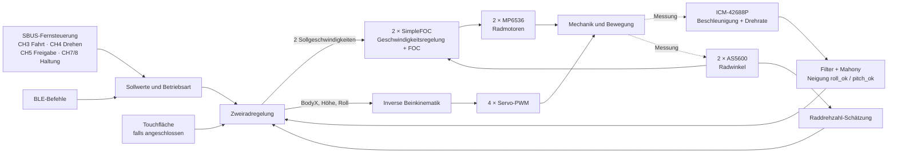

# Regelung des Navbot-ES02: Entwicklerübersicht

Stand: 28.09.2026 · Grundlage: **lokale, teils uncommittete Firmware** in [OllieFOCdrive.ino](../src/ES-02/OllieFOCdrive/OllieFOCdrive.ino). Diese Seite erklärt den derzeit kompilierten **Zweirad-/Master-Modus** auf dem ESP32-S3. Sie beschreibt den Code, nicht automatisch den Zustand eines später geflashten Roboters. Live geänderte PID-Werte gehen beim Neustart verloren.

## Die Idee in einem Satz

Der Roboter misst seine Neigung und treibt beide Räder unter den Schwerpunkt; gleichzeitig ändern vier Servos die Beinstellung. Ein Lenkbefehl erzeugt unterschiedliche Sollgeschwindigkeiten für das linke und rechte Rad.

Ein **Sollwert** ist das gewünschte Verhalten, ein **Istwert** die Messung. Ein PID-Regler berechnet aus ihrer Differenz eine Stellgröße. **P** reagiert auf den aktuellen Fehler, **I** sammelt einen Fehler über die Zeit, **D** reagiert auf seine Änderung. Für das Verständnis dieser Firmware ist entscheidend, *welche* Stellgröße ein Regler tatsächlich verändert.

## Signalfluss im aktiven Zweiradmodus

Die IMU sitzt laut PCB-Entwurf auf dem MAIN-Board. Jeder Radmotor hat einen AS5600-Winkelsensor auf einem eigenen I²C-Bus. Die Motoren werden mit drei PWM-Phasen über je einen MP6536 angesteuert; die vier Beinservos erhalten 50-Hz-PWM. Quellen: [Hardwareübersicht](../agent_notes/hardware-overview.md), [Motoren und Encoder](../agent_notes/hardware-reference.md#motoren-und-encoder), [Sensoren](../agent_notes/hardware-reference.md#sensoren-und-signale).

### Welche Regler beeinflussen was?

| Zweig | Fehler aus Soll- und Istwert | Ergebnis im aktiven Zweiradpfad |
| --- | --- | --- |
| **Neigung / Balance** | `angleError = roll_ok + BodyPitching_f` | `Angle_Pid` liefert den gemeinsamen Anteil beider Rad-Sollgeschwindigkeiten. `roll_ok` heißt im Code „roll“, ist hier der für Vor-/Zurückkippen verwendete Lagewinkel in Grad. |
| **Gieren / Lenken** | `yawError = attitude.gyro.z - BodyTurn` | `Yaw_Pid` liefert einen differentiellen Anteil: Rad 1 bekommt `−yawOutput`, Rad 2 `+yawOutput`. Der Gyro-Z-Wert und der Drehbefehl sind in rad/s. |
| **Fahren / Raddrehzahl** | `speedError = (Motor1_Velocity_f + Motor2_Velocity_f)/2 - MovementSpeed` | `Speed_Pid` erzeugt `BodyX`; damit verschiebt die Beinkinematik die Servo-Sollpositionen. **Dieser Ausgang wird im aktiven Pfad nicht vom Neigungssollwert der Radmotoren abgezogen.** |
| **Seitliche Haltung** | `RollError` aus `pitch_ok`, Roll-Sollwert und Touch-Y | Bei CH7/AUTO erzeugt `Roll_Pid` eine Höhenkorrektur zwischen den Beinen. Bei MANUAL ist sein Ausgang null. |
| **Touch-/Ball-Pose** | Touch-X/Y und CH9/10 | Verändert `BodyPitching`, einen seitlichen Touch-Anteil und damit mittelbar Rad- bzw. Servo-Vorgaben; siehe unten. |

Radmotoren im Kern: `target1 = angleOutput − yawOutput`, `target2 = angleOutput + yawOutput`; danach werden beide auf ±88 begrenzt. Die Vorzeichen sind Softwarekonventionen und ersetzen keinen Test der mechanischen Wirkrichtung. `PIDcontroller_posture()` ist der aktive Zweiradpfad. Die ungenutzte ältere Funktion `PIDcontroller_angle()` wurde am 01.10.2026 beim Aufräumen entfernt. Sie enthielt die klassische Kaskade „Geschwindigkeit → Neigung → Radmotor“, wurde von `loop()` aber nicht aufgerufen. Der Kommentar über `PIDcontroller_posture()` nennt ebenfalls eine Kaskade und ist an dieser Stelle irreführend.

**Zahlenbeispiel ohne I-/D-Anteil:** Bei `roll_ok=+1°`, `BodyPitching_f=0` und Balance-P=6 trägt der P-Anteil `+6` zur gemeinsamen Rad-Sollgeschwindigkeit bei. Liegt gleichzeitig `yawError=+0,2 rad/s` und Yaw-P=5 vor, ist der Gieranteil `+1`: Rad 1 erhält `6−1=5`, Rad 2 `6+1=7 rad/s`. Das Beispiel zeigt die Mischrechnung; die tatsächliche Reaktion hängt von Vorzeichen, Dynamik, I-/D-Anteilen und Begrenzung ab.

### Was passiert bei einem Fahrbefehl?

1. CH3 wird auf `MovementSpeed` abgebildet. Die Radwinkeländerung wird zur gefilterten Raddrehzahl; der Mittelwert beider Räder bildet den Istwert des Geschwindigkeitsreglers.
2. `Speed_Pid` berechnet `BodyX` aus Ist minus Soll. `BodyX` geht in die X-Koordinate der inversen Beinkinematik. Die Servos verlagern so die Geometrie und damit die Last relativ zu den Rädern.
3. Die IMU liefert über Mahony den Neigungswinkel `roll_ok`. `Angle_Pid` ändert die **beiden** Rad-Sollgeschwindigkeiten gemeinsam, damit die Neigung geregelt wird.
4. CH4 gibt `BodyTurn` vor. Der Gierregler vergleicht ihn mit `gyro.z` und erhöht die eine Rad-Sollgeschwindigkeit, während er die andere verringert.
5. SimpleFOC vergleicht die jeweilige Rad-Sollgeschwindigkeit mit dem Encoder und berechnet über FOC/PWM die Motoransteuerung. In dieser Konfiguration ist der SimpleFOC-Motormodus `velocity`, die innere Drehmomentregelung `voltage`; die optionalen Strommesskreise sind auskompiliert. `current_limit=5` ist daher **kein Nachweis** einer gemessenen oder hart begrenzten Akku-Stromstärke.

Das Verhalten ist durch die Mechanik gekoppelt: Eine Servo-Bewegung ändert die Lage; eine Radbewegung ändert Neigung und Raddrehzahl. Deshalb kann ein Zittern in beiden Aktorgruppen sichtbar werden, auch wenn der Anstoß nur aus einem Zweig kommt.

## Eingangsschalter und Zusatzfunktionen

| Eingang | Wirkung im aktuellen Zweiradcode |
| --- | --- |
| **CH1** | Seitlicher Haltungswunsch `BodyRoll` (bei AUTO wirksam). |
| **CH2** | Beinhöhe in Standard-/Ball-Pose; in Haltung 1 direkter `BodyPitching`-Wunsch. |
| **CH3** | Fahrwunsch `MovementSpeed`, normalerweise ±15; im aktuellen Diagnose-Quellstand ×2. |
| **CH4** | Drehwunsch `BodyTurn`, Bereich ungefähr ±11 rad/s nach Vorzeichenumkehr im Code. |
| **CH5** | 0: Rad-Sollwerte null, PID-Integratoren zurückgesetzt. 1 und 2: beide aktivieren denselben Zweirad-Regelpfad. Ohne Diagnoseüberschreibung wählen 1/2 verschiedene Gain-Sätze. |
| **CH6** | Posture: inverse Beinkinematik; Mark: Montage-/Kalibrierstellung der Servos. |
| **CH7** | MANUAL/AUTO für seitliche Ausregelung. AUTO aktiviert zusätzlich den `BodyPitching`-Pfad aus Touch-X und CH9. |
| **CH8** | Standard, Pitching Adjust, Ball Pose. Ball Pose aktiviert ebenfalls `BodyPitching` aus Touch-X und CH9. |
| **CH9/CH10** | Ball-Sollwerte `top_ball_x/y` von ungefähr ±5. CH9 kann die Neigungsvorgabe beeinflussen, auch wenn kein Touchscreen angeschlossen ist. |

**Wichtig für Vergleiche:** `BodyPitching` wird in Standardhaltung nicht überall explizit auf null gesetzt. Nach einem Moduswechsel kann ein vorheriger Wert im RAM weiterwirken, bis er überschrieben oder im CH5-aus-Pfad für `BodyPitching_f` zurückgesetzt wird. `Touch.XPdatF` ist ohne angeschlossenen Touchscreen nicht als gemessene Null belegt. Für einen Versuch CH7/CH8/CH9 und den Touch-Wert gemeinsam protokollieren.

BLE hat eine eigene Abbildung der Steuerkanäle. `loop()` ruft nach `CtrlInput()` zusätzlich `RXsbus()` auf. Kommt während einer BLE-Verbindung ein SBUS-Frame an, kann es damit die eben gesetzten BLE-Sollwerte überschreiben. Für Aussagen über die wirksame Befehlsquelle den tatsächlichen Eingangsverlauf messen.

## Takt, Einheiten und Filter

- In jedem `loop()`-Durchlauf laufen `motor.move()` und `motor.loopFOC()`. Der äußere Regelblock wird ab `time_dt >= 0.001 s` ausgeführt; das ist eine **Mindestschwelle**, keine garantierte 1-kHz-Rate. Ein gespeicherter Stillstands-Trace maß etwa 1,66 ms Median-Tick; unter anderer Last kann es abweichen.
- Die IMU wird im Hauptdurchlauf per SPI gelesen. Beschleunigung und Gyro werden tiefpassgefiltert und mit Mahony zum Lagewinkel fusioniert. Für den Gierregler wird `attitude.gyro.z` verwendet; das ist der skalierte rohe Gyro-Wert, nicht `gyrof.z`.
- Im aktuellen Diagnose-Quellstand wird die Raddrehzahl aus Encoder-Winkeldifferenz / **gemessenem `time_dt`** berechnet, dann mit einem SimpleFOC-Tiefpass (`Tf=0.01 s`) geglättet. Wird `DIAGNOSTIC_LIVE_TUNING_DEFAULTS` abgeschaltet, teilt der Code stattdessen durch feste `0.01 s`; das skaliert die Messung bei einem etwa 1,8-ms-Tick rechnerisch um Faktor 5,6 zu klein. Gain-Werte beider Stände sind deshalb nicht direkt vergleichbar.
- `roll_ok`/`pitch_ok` sind Winkel in Grad nach Abzug gespeicherter Nullpunkte. Der Gyro liefert rad/s. `BodyX` ist eine Kinematikverschiebung in Metern. Die Radziele sind SimpleFOC-Sollgeschwindigkeiten in rad/s. Die benannten PID-Gains tragen dadurch unterschiedliche implizite Einheiten; Zahlen aus verschiedenen Reglern lassen sich nicht direkt vergleichen.

## Aktuelle Parameter: Quellstand und Originalmodi

`DIAGNOSTIC_LIVE_TUNING_DEFAULTS=1` ist derzeit im lokalen Sketch gesetzt. Beim Start lädt die Firmware den sanfteren CH5=2-Satz, überschreibt Teile davon und lässt Live-Tuning eingeschaltet. Das gilt auch beim kurzen Durchschalten von CH5=1. Die zuletzt vom Nutzer live als günstig beschriebenen Werte `PP5`, `PD0.12`, `PL0.1` sind eine **Beobachtung**, keine Änderung dieser Startwerte.

| Größe | Aktueller Diagnose-Startwert | Original CH5=1 ohne Touch | Original CH5=2 mit Touch |
| --- | ---: | ---: | ---: |
| Balance P / I / D | 6 / 222 / 0,11 | 66 / 222 / 1 | 9 / 222 / 0,11 |
| Balance Integralzustand-Grenze | ±0,1 | ±0,1 | ±0,1 |
| Speed P / I / D, vor `/100` | 0,05 / 0 / 0 | 0,3 / 0,3 / 0 | 0,12 / 0,12 / 0 |
| Yaw P / I / D | 5 / 0 / 0 | 110 / 33 / 0 | 110 / 33 / 0 |
| CH3-Abbildung | ±15 × 2 | ±15 | ±15 |

Bei CH7/MANUAL setzt der Code Yaw-I auch im Originalmodus auf null. Die Grenze ±0,1 ist die Grenze des **Balance-Integralzustands**, nicht des Motorziels: Mit I=222 ergibt sie maximal ±22,2 Beitrag; P und D können weitere Anteile liefern. Das Motorziel selbst wird auf ±88 begrenzt. Die Speed-Koeffizienten werden in `PIDcontroller_posture()` durch 100 geteilt, bevor `Speed_Pid` sie nutzt. Serielle Kommandos wie `PP5`, `PD0.12`, `SP0.04` ändern die Werte nur bis zum Neustart; die Quelle und das geflashte Image müssen vor Messvergleichen abgeglichen werden.

## Freigabe und Schutz im Code

- CH5=0 oder erkannter Fall: Rad-Sollwerte null, `BodyX` und die PID-Integratoren zurückgesetzt. SimpleFOC läuft weiter; „Sollwert null“ bedeutet hier nicht abgeschaltete Endstufe.
- `Robot_Tumble()` setzt nach 20 aufeinanderfolgenden Regelaufrufen mit `|roll_ok| >= 35°` das Fall-Flag. Zur Freigabe muss der Winkel wieder `<= 5°` sein und der interne Zähler zurücklaufen. Die Zeit hängt vom realen Regeltakt ab.
- Die Akkuspannung kommt über GPIO17 von der **2S-Akkuleitung**, nicht von der 3,3-V-Schiene. Unter 7,4 V blinken/warnt die Firmware; in `RXsbus()` ist die Abschaltung auskommentiert. Ein Spannungseinbruch kann weitere Hardwareeffekte haben, wird von dieser Schwelle aber nicht aktiv unterbunden.
- `sBus.Failsafe()` wird im Sensor-Diagnosemodus ausgegeben, ist im normalen Zweirad-Regelpfad jedoch nicht als Freigabebedingung zu sehen. Die Reaktion auf einen verlorenen Empfänger hängt daher auch davon ab, welche Kanalwerte die SBUS-Bibliothek danach liefert.

## Wo Entwickler nachsehen sollten

| Frage | Code-/Dokumentationsstelle |
| --- | --- |
| Hardware, Anschlüsse, Evidenzgrad | [Hardwareübersicht](../agent_notes/hardware-overview.md), [Hardware-Referenz](../agent_notes/hardware-reference.md) |
| Startkonfiguration, SimpleFOC, Gains | `OllieFOCdrive.ino`: Defines am Anfang, `setup()`, `PidParameter()` |
| Aktiver Ablauf, Freigabe, Servo-Ausgabe | `OllieFOCdrive.ino`: `loop()` |
| Zweirad-PID und Motor-Mischung | `OllieFOCdrive.ino`: `PIDcontroller_posture()` |
| Fernsteuerung und Modi | `OllieFOCdrive.ino`: `RXsbus()`, `CtrlInput()` |
| IMU-Fusion und Nullpunkte | `OllieFOCdrive.ino`: `ImuUpdate()`; `MahonyFilter.cpp` |
| PID-Rechenvorschrift | `OllieFOCdrive.h`: `MyPIDController::compute()` |
| Beinkinematik und Servos | `OllieFOCdrive.ino`: `RightInverseKinematics()`, `LeftInverseKinematics()`; `ServoControl.cpp` |
| Vorhandene Versuche und offene Ursachen | [Balance-Fallakte](../agent_notes/balance-problem-handoff.md), [Fahr-Fallakte](../agent_notes/drive-instability-handoff.md) |
| K58-Fahrtrace mit Regleranteilen | [README](../README.md#capture-a-balance-shutdown), `scripts/capture_balance_trace.py` |

### Noch nicht geklärt

Die bestehenden Fahrtraces zeigen Nachlaufen und gelegentliches Gegenrollen nach CH3=0; Nutzerbeobachtungen nennen zudem Neigungszittern nach Fahrmanövern. Der Balance-I-Anteil erreichte in einem Trace ±22,2, was ein plausibler Beitrag, aber keine bewiesene alleinige Ursache ist. Verschiedene Versuche hatten andere Startneigungen und Befehlsimpulse. Auch Versorgungsabfälle wurden beobachtet, ohne dass Motorstrom und Servo-Strom getrennt gemessen wurden. Für eine kausale Aussage müssen geflashter Stand, Live-Gains, Schalterstellungen, `time_dt`, Radmessung, IMU-Winkel, PID-Anteile, Motorziele und Spannung im selben Versuch zusammenpassen.
